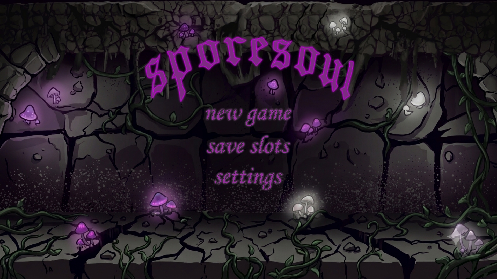

Добро пожаловать в репозиторий разработки проекта **Sporesoul** — 2D-метроидвании в стиле темного фэнтези, сфокусированной на механике вселения в тела и проработанном пиксель-арте. Этот документ составлен по стандартам игровых производственных шаблонов (gameplay playbooks) для координации работы программистов, геймдизайнеров и художников.

## ⚙️ Технологический стек и зависимости
* **Игровой движок:** Godot Engine  или Unity
* **Целевая платформа:** PC (Windows/Linux) с заделом под консольные SDK.
* **Правила контроля версий:** Git-flow workflow. Главные ветки: `main` (стабильные билды) и `develop` (ветка интеграции фич).

###прототип ui проекта
ниже представлен прототип начального экрана проекта который был выполнен в сторонней программе affinity

####🖼️ главное меню sporesoul

**основные особенности главного меню проекта**
1. **возможность создания нового слота сохранения путем нажатия кнопки "new game" которая расположена в интуитивно понятном месте относительно всего главного меню
2. **возможность непосредственного выбора слота сохранения игры из уже ранее созданного пользователем списка прохождений с помощью кнопки "save slots" (функция недоступная при попытке нажатия на нее не имея при этом ни одного сохранения прогресса то есть до момента первого прохождения)
3. **возможность переходить в меню настроек через кнопку "settings" где пользователю будет предложенно отрегулировать игрровой процесс под себя(настройка громкости, яркости и так далее..)

---